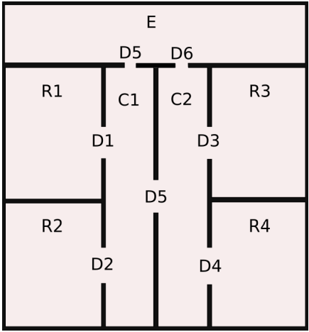
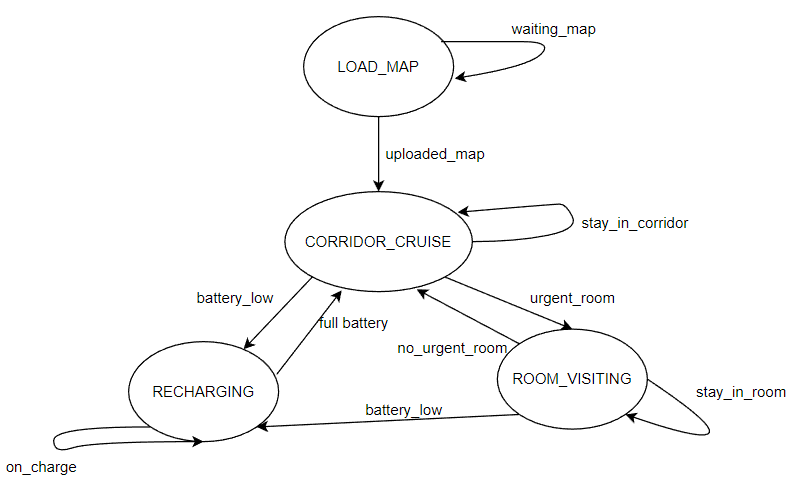
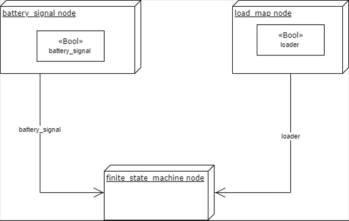

Finite-state-machine-Lab
===============================

Introduction
-----------------
This repository contains a ROS package of the software architecture for a surveillance  robot actuated through a finite state machine, building the ontology for Robot to move in. The architecture is described in the following report specifying the ROS nodes and how the architecture's component interact between each other. The full [documentation](https://alicecatalano.github.io/Finite-State-Machine-ExpLab/) is available to this link. Python3 is used as programming language and the [SMACH tool](http://wiki.ros.org/smach) is used to define the finite state machine and [SMACH viewer](http://wiki.ros.org/smach_viewer) is used as debugging tool together with [Protégé](https://protege.stanford.edu/) that consent to start the reasoning of the OWL ontology and to visualize the data and object properties of the individuals. The whole architecture depends from the [aRMOR service](https://github.com/EmaroLab/armor) to use OWL ontologies in a ROS architecture.

Software Architecture
--------------------------

### Scenario
In this repository the user will find an already designed ontology map in which the robot will exploit the surveillance function. The environment can be visualized in the following picture.  

  

The robot main behavior is to stay in the `CORRIDOR` and to move to the `ROOMS` when one of those becomes `URGENT` which is after 7 seconds after the room was visited.   
These 3 classes are the `LOCATION` subclasses, each individual will be classified by them and in the rooms case, the class `URGENT` will be added when the time threshold expires. `ROOM E` is a special room, used by the robot to recharge when the battery level is too low.  
For a more detailed explanation about the classes and other data and object properties, visit [topological map](https://github.com/buoncubi/topological_map).  
The behavior is designed to let the robot go in room in opposite positions, taking into account the map shown above for example, the robot is able to go from `R1` to `R4` if `R4` is `URGENT` while the robot is in `R1`.  
The `battery_status` variable can block the execution of any task and send the robot to recharge, switching to the designed status. After the robot is charged, it will start from the task interrupted before.  

### Finite state machine
  

The above diagram shows the Finite State Machine. It is composed by 4 main nodes, which are the states of the designed scenario:  
* **LOAD_MAP STATE**, is a simple state that waits for the map to be uploaded by the external node `Load_map()`, which will subscribe to the topic `/loader`, which will publish *True* when the map is totally uploaded. This will change a flag in the callback in the `finite_state_machine.py` and will let the code go to the next state.  
* **CORRIDOR_CRUISE STATE**, this state represent the idle state of the robot, if there are no urgent rooms the robot will keep moving between the 2 corridors. In this state the *emergency flags* are taken as `global` variables and used as external conditions, to give them in higher priority on the idle state.  
It calls the `change_position(robPos, desPos)` function, that is the main method in the Finite State Machine because it menages the robot movement, updates the timestamps and calls the function `find_path(l1, l2, robPos)` that calculates the best path for the robot to go from one `LOCATION` to another.  
* **RECHARGING STATE** as the name says this state keeps the code running while the robot charges, is the most simple and fast state. The `battery_status` is checked and if it's 0 the robot position will be changed to the `E ROOM` and will stay there until the external node `battery_signal.py`, which will keep the variable *True* until it gets low, then publishes on the topic `/battery_signal` the *False* and keeps it *False* until the time to recharge elapsed.  
* **ROOM_VISITING STATE**, this is the main state, is the state that will run more often because of the low threshold for the room urgency. All the calculation for this state rely on the `change_position(robPos, desPos)`: the state calls the function that keeps the list of urgent rooms updated and going through the list sends the desired position (desPos) to the function, that will upload the time stamps and the location of the robot.  

### Nodes interactions  
    

The diagram of how the nodes interact is simple, as the communication between them. The whole architecture is stored inside the Finite state function.  
* battery_signal node, publishes on the topic with the same name `/battery_signal` a boolean value, that will be retrieved  in the `callback_batt(data)` function in the `finite_state_machine.py`, when `battery_status` = 0 the battery is low and the robot will change state to the `Recharging` one; if it is equal to 1, the battery is charged and the code will get back to the `Corridor_cruise` state and then to the task that was left when the battery died.  
* load_map node, also here a simple publisher function that uses the `/loader` topic and will modify in the `callback(data)` the variable `**loading**: when it is equal to 1 the robot is still waiting for map, while when it's 0 the map got updated and the code will go to the `Corridor_cruise` state. This state will not be used anymore until the next run of the code.
After creating the ontology using the [aRMOR Service commands](https://github.com/EmaroLab/armor/blob/master/commands.md), all the rooms get the timestamp initialized with the robot going in each room and adding the *visitedAt* data property

Installation and running procedure
-------------------------------------
This repository has a lot of dependencies  coming from other ROS packages  like the [aRMOR](https://github.com/EmaroLab/armor) and the [SMACH](http://wiki.ros.org/smach) packages, so first of all these must be installed and run correctly as the sources explains.  
Another toll was used to keep the terminal cleaner from not needed messages which is xterm, which will put those messages given by the aRMOR service in another small terminal. The command to make this program execute is already in the launch file, if the user want to use this feature the following installing instruction is needed:
```bash
sudo apt-get -y install xterm
```
If the user would like not to use this tool, the launch file line can be deleted.  
After this set up, the clone of **this** repository must be done in the src folder of the user's ROS workspace.
```bash
cd <ros_workspace_path>/src
git clone https://github.com/AliceCatalano/Finite-state-machine-Lab.git
cd ..
catkin_make
```
after building the package successfully  the user should enter in the `load_map.py` and fix the path of the map in line 60 and 74, the same for the `finite_state_machine` code in the `Load_map` state inserting the same path of line 74. 
```bash
cd <ros_workspace_path>/src/Finite-statem-machine-Lab/assignment_1/scripts
```
In this folder be sure to change in executable all the .py files
```bash
chmod +x <name_of_file.py>
```
It is now possible to call the launch file and run the working code.

```bash
roslaunch assignment_1 launch.launch
```
The SMACH viewer is not inserted in the launch file, if the user wants to see the states going on and off the following command in another terminal
```bash
rosrun smach_viewer smach_viewer.py 
```

Explaining the video
------------------------
https://user-images.githubusercontent.com/91795156/204397040-b504ffd3-79fb-436a-b283-3a28e1e36219.mp4  

The video represents the code already running, so the `Load_map` state will not appear in green, while during the whole length of the video is possible to see how the other states exchange the lead in the code.  
As it shown here, the code is not really fast but every implementation ends in the correct status and position.  
Some control messages are printed to make the user understand if there's any bug or mistake in the implementation.  
**BE CAREFUL** if you see the code stuck and the *execute* window printing messages with a format containing ".java" expression, all similar between them and nothing else printing, it means there's an inconsistency in the ontology. This could happen if the user forgets to change correctly the path of the onotology maps used or if any other mistake is present in the code.

Working hypothesis and environment
--------------------------------------
### System feature
The scenario of the system has been exploited above, the assumptions behind this system is that the robot can actually reach any location, not directly but moving through common `connectedTo` positions, avoiding any infinite loop.  
Another important assumption is about the priority of the *emergency variables*, in this case it's assumed that the robot would go to charge before visiting any urgent room.


### System limitation
* The code is slow and takes time to compute the path
* The used map is a standard 2D environment, built by hard code and part of the code strictly use this information 
* There is not any user interface with which the user could create his own map at that moment or upload an existing ontology

### Possible technical improvements
Technical improvements would involve changing the structure of the code to make it faster in the computation especially  in the `changing_position` function, for example assuming that the robot can check just the urgency of the rooms next to him.  
Using thread and mutex to prevent the overwriting of the global variables would make the architecture more reliable and robust.

Authors and contacts
--------------------------
Code author: [Alice Maria Catalano](https://github.com/AliceCatalano)  
Email: alice99960@gmail.com  
Professor: [Luca Buoncompagni](https://github.com/buoncubi) and [Carmine Recchiuto](https://github.com/CarmineD8)
